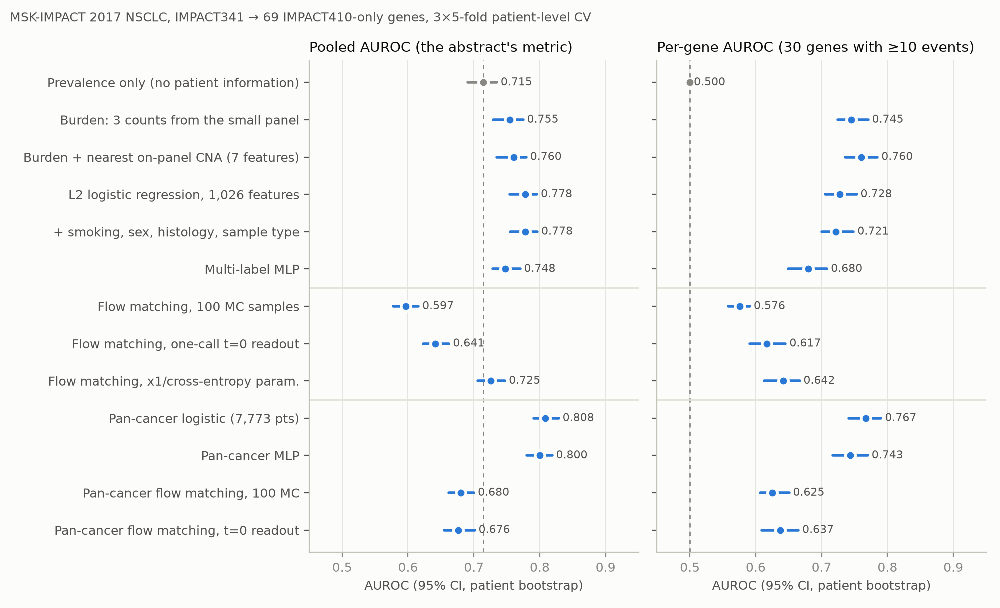
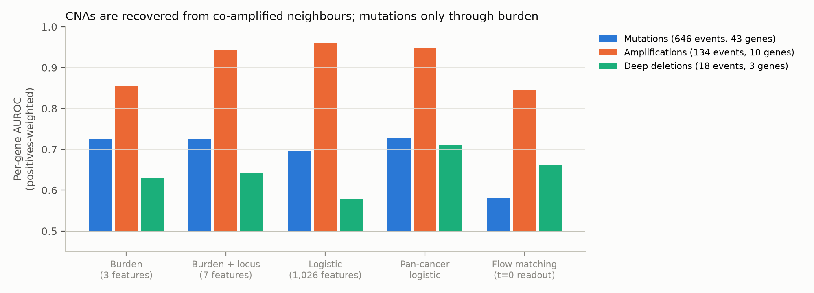
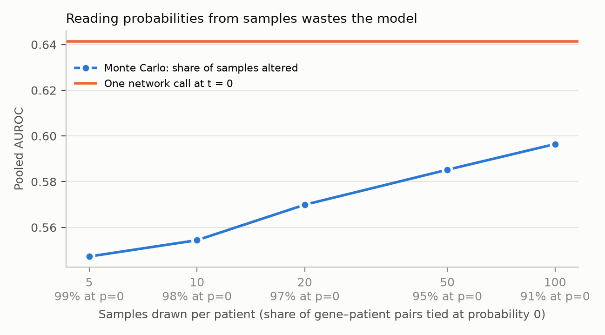

# Genomic panel completion with flow matching — ML review

Review of the accepted abstract on reconstructing the IMPACT505 panel from IMPACT341 with conditional flow matching
(MSK-CHORD NSCLC, n = 2,226). Every major recommendation is tested on public data.

**How the claims were tested.** MSK-CHORD is not public, so the task was rebuilt on the MSK-IMPACT 2017 cohort
(Zehir et al., *Nat Med* 2017; cBioPortal `msk_impact_2017`). IMPACT341 is a strict subset of IMPACT410 and of IMPACT505,
so the analogue task is to predict the **69 IMPACT410-only genes** (all 69 are among the abstract's 164) from the 341 shared
genes, in **1,215 NSCLC patients** sequenced on IMPACT410. With the abstract's encoding (non-synonymous mutation,
amplification or deep deletion, one binary per gene), 1.11% of gene–patient pairs are altered, against 1.21% in the
abstract. The two tasks are close enough that the failure modes below should transfer. The absolute numbers will not, so
every number here is a prompt to compute the same quantity on MSK-CHORD. Code: [`panel-completion/`](../panel-completion/).

---

## Summary: the seven changes that matter most

| # | Change | Why (replicate evidence) | Where |
| --- | --- | --- | --- |
| 1 | **Report the prevalence baseline's number and a per-gene AUROC.** | A model that knows only each gene's frequency scores a pooled AUROC of **0.715**. Plain L2 logistic regression scores **0.778**, inside the abstract's 0.77–0.79. Per gene, prevalence is exactly 0.5. | §2 |
| 2 | **Add a baseline ladder on the same splits**: burden, burden + locus, L2 logistic, pan-cancer logistic. | A 7-feature model (mutation/CNA counts + nearest on-panel CNA) matches or beats 1,026-feature models per gene (0.760 vs 0.728). | §3 |
| 3 | **Replace the single 75/15/15 split** (which sums to 105%) with repeated patient-level CV, patient-bootstrap CIs and paired model comparisons. | Pooled AUROC of the *baseline alone* ranges 0.68–0.74 across 20% folds. In one 15% test set, 19 of 69 genes have zero events. | §1, §2 |
| 4 | **Break results down by event type and mechanism**, and evaluate actionable genes separately. | Amplifications: AUROC 0.96, from co-amplified on-panel neighbours (NFKBIA with NKX2-1 in 39/39 cases). Mutations: 0.73, the same as with 3 burden counts. | §4 |
| 5 | **Fix and justify the generative part**: read probabilities at t = 0, check sampled vs observed alteration rates, and score the joint distribution against independent draws. | Monte Carlo readout with 100 samples leaves 91% of pairs tied at 0. A standard CFM samples 0.35% alterations vs 1.11% true. Independent draws from logistic marginals beat CFM samples on the energy score. | §5 |
| 6 | **Close the leakage and simulation gaps**: patient-level splits, "not assayed" ≠ wild type, and a test on patients with two real assays. | Real small-panel input: pooled AUROC **0.70** vs **0.84** for the simulated mask. Zero-filling unassayed genes shifts calibration by 25% with no AUROC change. | §6 |
| 7 | **Scale up and reframe**: pan-cancer and all-panel-version training; present the model as triage for broad CGP, not a substitute. | Pan-cancer training: +0.04 per-gene AUROC. PPV at 80% sensitivity: 2.5%. Referring the top 25% of patients captures 45% of those with a missed alteration. | §7, §8 |

---

## 1. Corrections to the abstract as written

These are fixable in the camera-ready abstract or on the poster without new experiments.

| Where | As written | Problem | Suggested fix |
| --- | --- | --- | --- |
| Methods | "trained on 75% … 15% for further validation … last 15% of held-out patients" | 75 + 15 + 15 = 105% | "70% training, 15% validation (model selection only) and 15% held-out test, split by patient" |
| Methods | "2,226 patients" | Patients or samples? MSK-IMPACT has several samples per patient (primary + metastasis, re-biopsies) | State one sample per patient or a patient-grouped split (see §6) |
| Methods | "non-synonymous mutations and copy-number alterations" | Undefined: VUS included? Which CNA calls (deep deletion / high-level amplification only)? Fusions excluded? | Define the event set. Note that excluding structural variants leaves out the most actionable NSCLC class (ALK, ROS1, RET, NTRK1-3, NRG1) |
| Results | "AUROC … in the 0.77–0.79 range" | No CI; the metric is pooled over gene–patient pairs (not stated); the baseline's own AUROC is not given | "Pooled AUROC 0.78 (95% CI a–b) vs b0 for prevalence alone; per-gene AUROC c (CI)" |
| Results | "exceeded a prevalence-only baseline" | Under a pooled AUROC this baseline scores far above 0.5 (0.72 in the replicate), so exceeding it is the minimum bar | Report the margin and its CI (§2) |
| Results | "able to correctly predict the missing genes" | AUROC measures ranking, not correctness; at ~1% prevalence even a good AUROC gives a low PPV (§8) | "ranked altered gene–patient pairs above unaltered ones" |
| Results | "variants of neural network architecture, and training paradigm" | Not named; how many were tried; selected on validation or test? | Name them; state that selection used validation data only |
| Conclusions | "recover clinically relevant genomic information" | Clinical relevance was not evaluated | Either evaluate the actionable subset (§4) or drop "clinically relevant" |

## 2. The metric: pooled AUROC mostly measures which genes are common

The abstract reports one AUROC over all gene–patient pairs. That pools genes with very different alteration rates:
in the replicate, ZFHX3 is altered in 5.6% of patients and 13 held-out genes in fewer than 0.4%. A model that
knows only each gene's training frequency ranks every ZFHX3 pair above every rare-gene pair and so wins most pairwise
comparisons **without using any information about the patient**. In the replicate that prevalence-only model scores a
**pooled AUROC of 0.715** (95% CI 0.691–0.735). On a single 20% test fold it ranges from 0.676 to 0.741 depending
on which patients land in the fold.

So "exceeded a prevalence-only baseline" is the minimum bar, and the abstract never says by how much. In the replicate,
plain L2 logistic regression scores a pooled 0.778, inside the abstract's 0.77–0.79. The tasks differ (69 vs 164
genes, a different cohort), so this does not mean the flow model equals logistic regression on MSK-CHORD. It does mean
the headline number cannot be interpreted without the same baselines on the same split.



**2.1 Report per-gene AUROC.** Compute an AUROC separately for each held-out gene with enough events and average it.
Prevalence scores exactly 0.5 there, so everything above 0.5 is patient-specific information. Keep pooled AUROC as a
secondary metric. The two can rank models differently: in the replicate, a 7-feature per-gene model beats the
1,026-feature logistic regression per gene (0.760 vs 0.728; paired Δ +0.034, 95% CI 0.020–0.050) but loses on pooled
AUROC (0.760 vs 0.778). Pooled AUROC rewards getting the between-gene calibration right; per-gene AUROC rewards
discriminating patients.

**2.2 Enough events per gene needs cross-validation, not one 15% split.** 30 of the 69 held-out genes have ≥10 events
in the whole replicate cohort. In a single 15% test set (182 patients), a median of **8 genes have ≥5 events and 19
have none**. On MSK-CHORD the test set is larger (≈334 patients) but the 164 genes are rarer on average, so the problem
is the same. Use repeated patient-level K-fold CV (the replicate uses 3 × 5-fold) and report how many genes enter the
per-gene mean.

**2.3 Pitfall when pooling out-of-fold predictions.** Concatenating out-of-fold predictions and computing one AUROC
compares scores from different models. With rare targets this is biased: a fold holding more positives for a gene
trains on a lower prevalence for that gene. In the replicate, **the prevalence-only model scores 0.38 per gene on
pooled out-of-fold predictions instead of 0.5.** Count only positive–negative pairs within the same fold
(fold-stratified AUROC; `strat_auroc` in [`pc_common.py`](../panel-completion/pc_common.py)).

**2.4 Report more than ranking.** At 1.1% prevalence AUROC hides most of what matters:
- *AUPRC per gene, as lift over prevalence.* Logistic regression: 13× lift on average.
- *Calibration.* Brier skill score vs prevalence and predicted/observed event rate. Section 6.2 shows an encoding bug
  that leaves AUROC unchanged and moves calibration by 25%.
- *Patient level.* AUROC for "≥1 alteration among the held-out genes": 0.79 for logistic regression.
- *Uncertainty.* 95% CIs from a **patient-level** bootstrap, because pairs from one patient are correlated. Report
  model comparisons as paired differences on the same resamples. Across single test folds, the SD of pooled AUROC is
  about 0.02 for every baseline, so a 0.77–0.79 spread across architecture variants is within noise unless shown otherwise.

## 3. Baselines the model has to beat

Every row below uses identical patient-level folds (3 × 5-fold CV; the neural and pan-cancer models use 1 × 5-fold).
The full table is in [`results/metrics_any.csv`](../panel-completion/results/metrics_any.csv).

| Model | Features | Pooled AUROC (95% CI) | Per-gene AUROC (95% CI) | Brier skill |
| --- | --- | --- | --- | --- |
| Prevalence | none | 0.715 (0.691–0.735) | 0.500 | 0 |
| Burden | log counts of mutations, amplifications, deletions on the small panel | 0.755 (0.730–0.775) | 0.745 (0.724–0.771) | 0.017 |
| Burden + locus | + CNA state of the nearest on-panel gene and any CNA within ±5 Mb | 0.760 (0.735–0.779) | **0.760** (0.736–0.785) | 0.032 |
| L2 logistic regression | 1,026 (mutation / amp / del × 341 genes + burden) | 0.778 (0.754–0.796) | 0.728 (0.705–0.753) | 0.042 |
| + clinical covariates | + smoking, sex, histology, sample type | 0.778 (0.755–0.796) | 0.721 (0.700–0.748) | 0.042 |
| Multi-label MLP | 1,026 | 0.748 (0.728–0.770) | 0.680 (0.650–0.708) | 0.023 |
| **Pan-cancer L2 logistic** | 1,026 + cancer type, trained on 7,773 patients | **0.808** (0.791–0.829) | **0.767** (0.741–0.790) | 0.036 |
| Pan-cancer MLP | same | 0.800 (0.781–0.819) | 0.743 (0.717–0.770) | 0.053 |

What to add to the paper:
1. **Prevalence**: the number, not only the statement that it was beaten.
2. **Burden** (3 features) and **burden + locus** (7 features per gene). These are interpretable, need no deep learning,
   and set the bar for "the model learned something beyond TMB and genomic proximity".
3. **L2-regularised logistic regression**, one per gene, on the same input encoding. This is the standard multi-label
   baseline, and it is what a reviewer will ask for first.
4. **A gradient-boosted or MLP multi-label classifier** with the same capacity budget as the flow model's encoder.
5. The flow model with its readout fixed (§5), on the same splits, with a **paired** bootstrap CI for its difference
   from the best baseline.

If the flow model does not beat (3) with a paired CI excluding zero, the defensible claim is about the *task* ("a
smaller panel predicts X of a larger panel") and the evaluation, not about flow matching.

## 4. Where the recoverable information comes from



Split the positives by event type (per-gene AUROC, positives-weighted, other positives excluded):

| Event type (replicate) | Events | Burden (3 features) | Burden + locus | L2 logistic | Pan-cancer logistic |
| --- | --- | --- | --- | --- | --- |
| Amplifications | 134 in 10 genes | 0.85 | 0.94 | **0.96** | 0.95 |
| Mutations | 646 in 43 genes | **0.73** | 0.73 | 0.70 | **0.73** |
| Deep deletions | 18 in 3 genes | 0.63 | 0.64 | 0.58 | 0.71 |

- **Amplifications are recovered almost perfectly, and for a mechanical reason: amplicons span several genes.** All
  **39/39** NFKBIA amplifications in the replicate co-occur with amplification of NKX2-1 (14q13, 1.1 Mb away, on
  IMPACT341), and all **20/20** GLI1 amplifications with CDK4 (12q14, 0.3 Mb). A 7-feature model with the nearest
  on-panel gene's CNA state already reaches 0.94.
- **Mutations are predicted only through mutational burden.** Three counts from the small panel score as well as
  1,026 features. The full logistic model does *worse* (0.70). A tumour with many mutations on the small panel has
  more in the unseen genes too, especially large genes such as ZFHX3, EPHA7 and MGA. That is a statement about TMB,
  not about individual driver events.
- **Restricting to driver-like events** (truncating or recurrent missense, plus CNAs; [`results/metrics_driver.csv`](../panel-completion/results/metrics_driver.csv))
  gives per-gene AUROC 0.72 (burden) and 0.67 (logistic) for driver mutations. The pattern is the same.

For the paper:
1. Report performance **by event type**, and **by mechanism**: held-out genes with vs without an on-panel neighbour in
   the same amplicon, and high- vs low-TMB tumours.
2. Show the burden and locus baselines. They make explicit that the information "outside the assayed gene set" is
   largely genomic proximity plus mutational burden. That is a useful, honest finding and the right framing for the
   conclusion.
3. **Evaluate the clinically actionable subset on its own**, e.g. the held-out genes with OncoKB level 1–3 evidence in
   NSCLC, with oncogenic/likely-oncogenic variants as the target rather than all non-synonymous ones. This is the only
   way to support "clinically relevant". Report how many events there are; it may be too few to estimate, which is
   itself a finding.

## 5. The generative model: justify it, then read it out correctly

Code: [`pc_models.py`](../panel-completion/pc_models.py) (`CFM`), [`04_joint.py`](../panel-completion/04_joint.py).
The replicate uses a standard continuous relaxation, which is presumably close to the abstract's setup:
targets mapped to {−1, +1}, a linear Gaussian-to-data path, and an MLP velocity field conditioned on the observed panel.

**5.1 Marginal probabilities do not need a generative model.** On the linear path, x<sub>t</sub> at t = 0 is pure
noise and independent of the target. The MSE-optimal velocity there is therefore v\*(x<sub>0</sub>, 0, c) =
E[x<sub>1</sub> | c] − x<sub>0</sub>, so **one network call at t = 0 returns the conditional alteration
probabilities**, p = (1 + x<sub>0</sub> + v(x<sub>0</sub>, 0, c)) / 2. In other words, a CFM's per-gene predictions
are those of a regression model trained with squared loss on a slice of its training signal. Any advantage of
generating must show up in the *joint* distribution (§5.4). If it does not, a multi-label classifier is the simpler,
better-calibrated tool, and the paper's contribution is the task and its evaluation.

| Flow-matching variant (replicate, NSCLC-only) | Pooled AUROC | Per-gene AUROC | Predicted / observed rate |
| --- | --- | --- | --- |
| Velocity/MSE, probability = share of 100 samples altered | 0.597 | 0.576 | 0.31 |
| Velocity/MSE, one call at t = 0 | 0.641 | 0.617 | 3.23 |
| x1-prediction with cross-entropy, one call at t = 0 | 0.725 | 0.642 | 0.96 |
| *L2 logistic regression, same folds* | *0.778* | *0.728* | *0.93* |

These are the replicate's own implementations, tuned only briefly. The abstract's 0.77–0.79 shows the authors' model is better tuned.
The point is the diagnostics, which should be run on the real model.

**5.2 Reading probabilities from samples throws accuracy away.** If P(altered) is estimated as the fraction of S
sampled profiles in which the gene is altered, its resolution is 1/S. At ~1% prevalence almost every gene–patient pair
gets exactly 0 and ties. With S = 100, **91% of pairs tie at 0** and pooled AUROC drops from 0.641 (one call at t = 0)
to 0.597. With S = 10 it is 0.554. State how probabilities were obtained, use the t = 0 readout, or use S large enough
that the curve has flattened.



**5.3 A continuous relaxation struggles with rare binary events.** With MSE on the velocity, the loss is dominated by
the Gaussian noise. The differences that matter (a 0.2% vs 3% alteration rate) are tiny in {−1, +1} space. The
replicate's velocity model **samples alterations at 0.35% against a true 1.11%**. Only 16% of patients receive any
sampled held-out alteration, against 43% in reality. Its t = 0 readout loses even the gene-prevalence ranking and
scores *below* the prevalence baseline on pooled AUROC. Predicting the clean state with cross-entropy (x1
parameterisation) fixes most of the calibration (predicted/observed 0.96) and much of the ranking. However, in a
diagnostic run its ODE samples almost never produced a rare alteration. Two actions:
- Always report **sampled vs observed alteration rate**, overall and per gene, as a sanity check on the generator.
- Consider generative models built for discrete data: discrete flow matching (Campbell et al., ICML 2024; Gat et al.,
  NeurIPS 2024), Dirichlet flow matching (Stark et al., ICML 2024), or masked discrete diffusion (Sahoo et al.,
  NeurIPS 2024; Shi et al., NeurIPS 2024). Masked diffusion trains by masking random subsets of genes and
  reconstructing them, which is exactly panel completion, for *any* observed subset.

**5.4 Evaluate the joint distribution, or drop the generative claim.** Compare sampled profiles against independent
Bernoulli draws from a good classifier's marginals, using a proper scoring rule for the whole vector.

| Replicate, 1,215 patients × 100 draws | Energy score ↓ | Alteration rate | Patients with ≥1 held-out alteration |
| --- | --- | --- | --- |
| Truth | – | 1.11% | 43% |
| Flow-matching samples | 0.782 | 0.35% | 16% |
| Independent draws, logistic-regression marginals | **0.718** | 1.03% | 48% |
| Independent draws, prevalence | 0.750 | 1.16% | 56% |

The flow samples do capture dependence that independent draws cannot, but only for same-locus pairs.
**RAD21/ELOC** (both 8q) co-occur 5 times; flow samples expect 0.68 and independent draws 0.28. **H3C13/H3C14** (1q21
histone cluster) co-occur 5 times; the expectations are 0.44 vs 0.04. Overall, poor marginals outweigh that
advantage. Report the energy score (or the multivariate CRPS / MMD with a Hamming kernel), the distribution of the
number of held-out alterations per patient, and observed vs expected co-occurrence for known pairs. Pick pairs a
priori; selecting them on observed counts inflates the observed column.

**5.5 What would make the generative framing compelling.**
1. *Any panel to any panel.* Train once with random gene masking over the union of genes, then condition on whatever
   subset was assayed (IMPACT341, FoundationOne CDx, Oncomine, TSO500 …). A single masked model replaces one model per
   panel pair, and it can learn from every MSK-CHORD patient, not only those on IMPACT505 (§7). This is where masked
   discrete diffusion is the natural fit.
2. *Multiple imputation.* Draw K completed profiles per patient and propagate imputation uncertainty into downstream
   analyses (for example survival by alteration status in the imputed genes). Only a generative model can do this
   correctly, and it is a concrete use for the samples.
3. *Coherent profiles.* Show that samples respect known structure (EGFR/KRAS mutual exclusivity, STK11/KEAP1
   co-occurrence, amplicon co-amplification) better than independent draws do.

## 6. Data leakage and the simulation-to-reality gap

Code: [`05_leakage_and_shift.py`](../panel-completion/05_leakage_and_shift.py). Output:
[`results/leakage_and_shift.json`](../panel-completion/results/leakage_and_shift.json).

**6.1 Split by patient, not by sample.** In the replicate, 60 of 1,279 NSCLC IMPACT410 samples come from patients with
more than one sample. With a sample-level split, a patient's primary and metastasis can sit on opposite sides, and their
shared truncal alterations leak. For those 60 patients, pooled AUROC is **0.80 with a sample-level split and 0.72 with a
patient-level split**. The overall effect is small here (0.773 vs 0.767) because only 5% of samples are affected. In
MSK-CHORD, with more longitudinal sampling, the share may be larger. Use one sample per patient (pre-specify which one:
first, or primary over metastasis) or a grouped split, and say so.

**6.2 "Not sequenced" must not become "wild type".** cBioPortal's discrete CNA matrix stores **0, not NA**, for genes a
sample's panel never targeted. The mutation table simply has no rows for them. Anyone who concatenates samples across
panel versions without the gene-panel matrix therefore labels every unassayed gene as unaltered. In the replicate,
adding 348 IMPACT341-sequenced NSCLC patients this way leaves AUROC unchanged (0.774 vs 0.776) but pulls **predicted
alteration rates down from 93% to 69% of the observed rate**. The damage is invisible to AUROC, so calibration has to
be reported (§2). If the MSK-CHORD cohort was assembled from a multi-panel export, check this before anything else.

**6.3 The benchmark is a simulation; test the real thing.** Masking a 505-gene assay down to its 341-gene subset is not
the same as running a 341-gene assay. In deployment the input comes from a separate specimen, taken at a different time
and processed through a different CNA segmentation (fewer probes means noisier copy-number calls), with a different TMB
denominator. The replicate contains 167 patients sequenced on both IMPACT341 and IMPACT410. Training a pan-cancer model
on everyone else and predicting the IMPACT410-only genes of the IMPACT410 sample:

| Input | Pooled AUROC | Per-gene AUROC |
| --- | --- | --- |
| Simulated: the IMPACT410 sample masked to 341 genes (the abstract's protocol) | **0.84** | **0.80** |
| Real: the patient's separate IMPACT341 assay | **0.70** | **0.61** |

Only 44% of the observed-panel alterations agree between the two assays of the same patient (Jaccard). Part of the gap
is tumour heterogeneity and evolution rather than assay differences, but that is exactly what a clinician using the
tool would face. The simulated protocol is an upper bound. MSK-CHORD patients re-sequenced on a newer panel version
provide the same paired design at scale. Report it as a second test set.

**6.4 Other shifts to name.** *Temporal:* IMPACT341 was the 2014–2015 assay, while IMPACT505 is the current version from the 2020s. Train on
earlier patients and test on later ones, since treatment exposure (e.g. post-TKI resistance biopsies) changes the
alteration spectrum. *Matched normal:* MSK-IMPACT calls somatic variants against a matched normal, while most
external panels run tumour-only, so germline variants and CHIP enter their inputs. *Purity:* low-purity samples lose
CNA calls; stratify performance by tumour purity.

## 7. Scale: the cohort is small for a deep generative model

About 2,200 patients and ~500 binary features is a small-data regime for a deep conditional generative model. In the
replicate, the NSCLC-only MLP is worse than logistic regression (per-gene 0.680 vs 0.728).

**7.1 Train pan-cancer, condition on cancer type.** Training on all 7,773 IMPACT410 patients (cancer type as a
covariate, NSCLC test folds held out) gives the largest gain of any change in the replicate: pooled AUROC **0.808 vs
0.778**, per-gene **0.767 vs 0.728** (paired Δ +0.039, 95% CI 0.024–0.057). Amplicon structure and burden–mutation
relationships are largely shared across tumour types. The pan-cancer flow model also improves (pooled 0.676 vs
0.641), but not enough to catch up.

**7.2 Use every patient, not only IMPACT505 ones.** MSK-CHORD spans IMPACT341/410/468/505. With masked training
(loss only on genes the sample's panel assayed; the gene-panel matrix tells you which), every patient contributes to
every gene they were sequenced for. IMPACT468 alone covers 127 of the 164 held-out genes. This is a natural fit for
masked diffusion (§5.3), and it is how the "different panels at different institutions" motivation becomes a model:
one network that completes any panel.

**7.3 External data.** AACR Project GENIE (~200,000 samples, dozens of panels) supports pre-training and a genuinely
external test: train on MSK, test on centres whose panel is a subset of IMPACT505, restricted to shared genes.
Expect a drop from tumour-only calling and different CNA pipelines (§6.4). That is the result the Background
motivates.

## 8. Clinical framing: from "reconstruction" to triage

At 1.1% prevalence even a well-ranked score gives a low positive predictive value
([`results/operating_points_any.csv`](../panel-completion/results/operating_points_any.csv)):

| Replicate (pooled gene–patient pairs) | PPV at 50% sensitivity | PPV at 80% sensitivity |
| --- | --- | --- |
| Prevalence only | 2.7% | 1.5% |
| L2 logistic | 5.2% | 1.9% |
| Pan-cancer logistic | 6.8% | 2.5% |

At 80% sensitivity, roughly 1 in 40 predicted alterations is real. No imputed alteration can guide therapy, and the
paper should say so plainly.

The use-case that fits these numbers is **triage**: rank patients by P(≥1 alteration in the genes the small panel
misses, or better, ≥1 *actionable* one) and send the top fraction for broad CGP or RNA fusion testing. In the replicate,
referring the top 25% of patients captures 45% of those with a held-out alteration (random: 25%), and the top 50%
captures 74%. Present it with a decision curve (net benefit vs threshold) against "test everyone" and "test no one".
Restrict it to actionable events, where the stakes are. This turns "reconstructing" (which the data do not support)
into "prioritising" (which they might).

## 9. Reporting checklist for the full paper

Follow TRIPOD+AI (Collins et al., *BMJ* 2024). The items reviewers of a genomics-ML paper will look for:

- [ ] **Cohort:** MSK-CHORD release; inclusion (histology, stage, primary vs metastasis); samples vs patients; the one-sample
      rule; panel version per sample; number excluded and why.
- [ ] **Event definitions:** mutation filter (VUS? OncoKB-oncogenic only as a sensitivity analysis), CNA caller and
      thresholds, SV/fusion handling, germline filtering; how "not assayed" is represented.
- [ ] **Splits:** patient-grouped, stratified by (at least) histology; repeated K-fold or nested CV for the main table;
      a single untouched test set only if it is large enough (§2.2).
- [ ] **Model selection:** every configuration tried, the selection criterion, and confirmation that the test set was
      used once.
- [ ] **Uncertainty:** patient-bootstrap 95% CIs; ≥3 training seeds; paired comparisons between models.
- [ ] **Metrics:** pooled and per-gene AUROC, per-gene AUPRC with prevalence, Brier skill score, calibration
      (in-the-large and slope), patient-level "any held-out alteration" AUROC; results by event type and for the
      actionable subset.
- [ ] **Baselines:** the ladder in §3, on the same splits.
- [ ] **Generative-model specifics:** probability readout (MC with n samples, or analytic); sampled vs observed
      alteration rate; a joint-structure metric (§5.4); ODE solver and step count.
- [ ] **External / real-assay validation:** paired re-sequenced patients (§6.3); temporal split; GENIE if possible.
- [ ] **Subgroups:** LUAD vs LUSC, smoking status, sex, race/ethnicity or genetic ancestry where available, tumour purity.
- [ ] **Availability:** code, trained weights, gene lists, split IDs.

## 10. Suggested revised abstract

Square brackets are numbers to compute on MSK-CHORD with the protocol above. The structure stays within a typical
conference word limit and makes no claim the analyses do not support.

> **Background**
> Comprehensive genomic profiling (CGP) is central to precision oncology, but panel sizes differ widely across
> institutions. Smaller targeted panels reduce cost and turnaround time but leave part of the tumour genome unmeasured.
> We asked how much of a large panel's alteration profile can be inferred from a smaller panel, and where that
> information comes from.
>
> **Methods**
> We analysed [n] patients with non-small cell lung cancer from MSK-CHORD sequenced with MSK-IMPACT505 (one sample per
> patient). The task was to predict alterations (non-synonymous mutations, amplifications and deep deletions; one binary
> event per gene) in the 164 genes present in IMPACT505 but absent from IMPACT341, given the 341 IMPACT341 genes. A
> conditional flow-matching model was trained on 70% of patients, with 15% for model selection and 15% held out
> (patient-level split, [k] repeats). We compared it with prevalence-only, mutational-burden and L2-regularised logistic
> regression baselines on identical splits, reporting pooled and per-gene AUROC with patient-bootstrap 95% CIs, and
> tested it on [m] patients sequenced on both an earlier and a later panel version.
>
> **Results**
> Held-out genes were altered in 1.21% of gene–patient pairs and in [x]% of patients. Pooled AUROC was 0.78 [CI], vs
> [b] for prevalence alone and [c] for logistic regression. Per-gene AUROC, where prevalence scores 0.50, was [d] [CI].
> Copy-number alterations were recovered well (per-gene AUROC [e]), largely through co-amplification and co-deletion
> with neighbouring genes on the smaller panel. Mutations were predicted modestly ([f]), mainly through tumour
> mutational burden. On patients with two real assays, pooled AUROC was [g].
>
> **Conclusions**
> A targeted panel carries information about genes it does not assay, concentrated in copy-number events at assayed
> loci and in mutational burden. At current accuracy, such models could prioritise patients for broader profiling but
> cannot replace it.

---

## Appendix: replicate analysis

**Data.** MSK-IMPACT 2017, cBioPortal study `msk_impact_2017` (ODbL; Zehir et al., *Nat Med* 2017). Gene panels
come from cBioPortal `reference_data/gene_panels`. Legacy HGNC symbols in the mutation and CNA files (MLL2, HIST1H3B …)
are mapped to the panel symbols (KMT2D, H3C2 …). For IMPACT341 samples, the 69 unassayed genes are set to missing.

**Cohort.** 1,279 NSCLC samples sequenced on IMPACT410 from 1,215 patients (first sample per patient kept). Targets:
69 IMPACT410-only genes. Event = non-synonymous mutation (missense, nonsense, frameshift, splice site, in-frame indel,
start/stop loss), amplification (discrete CNA call +2) or deep deletion (−2). 931 events (1.11% of gene–patient
pairs): 707 mutations, 170 amplifications, 57 deletions. 43% of patients have at least one.

**Features.** Mutation / amplification / deletion indicators for the 341 IMPACT341 genes plus three log burden counts
(1,026 features). The locus baseline uses gene positions estimated from variant coordinates (hg19).

**Models** ([`pc_models.py`](../panel-completion/pc_models.py)). Per-gene L2 logistic regression (penalty chosen on an
inner 15% validation split by log-loss); two-layer MLP with early stopping; conditional flow matching (3-layer, 512-wide
MLP velocity field with a 256-d condition encoder, sinusoidal time embedding, AdamW, cosine schedule, EMA, checkpoint
by validation loss, 32-step Euler sampler); pan-cancer variants trained on 7,773 IMPACT410 patients with 15
cancer-type indicators.

**Evaluation** ([`03_report.py`](../panel-completion/03_report.py)). 3 × 5-fold patient-level CV for the cheap models,
1 × 5-fold for flow matching and pan-cancer. Fold-stratified AUROC; per-gene mean over the 30 genes with ≥10 events;
patient bootstrap (200 resamples) for CIs and paired differences.

**Limitations of the replicate.** 69 rather than 164 held-out genes, and a 2014–2016 cohort. The flow-matching models
are quick, lightly tuned implementations: their numbers illustrate the diagnostics and do not estimate the authors'
model. Deep deletions are too rare in the held-out genes (57 events) for stable estimates. H3C14 has no observed variant to
place it on the genome, so its locus features are zero.

**Reproduce.**

```bash
export MSK_IMPACT_DIR=/path/to/msk_impact_2017
cd panel-completion
python 01_dataset_summary.py && python 02_benchmark.py driver && python 02_benchmark.py any
python 03_report.py any && python 03_report.py driver && python 04_joint.py
python 05_leakage_and_shift.py && python 06_figures.py
```
